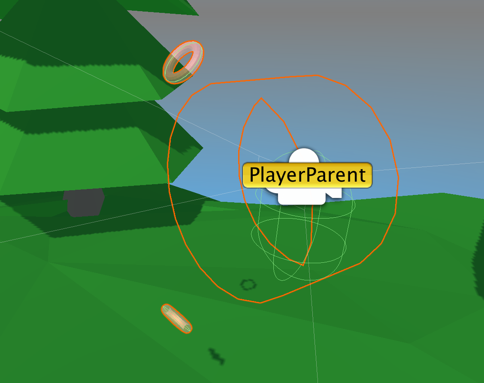
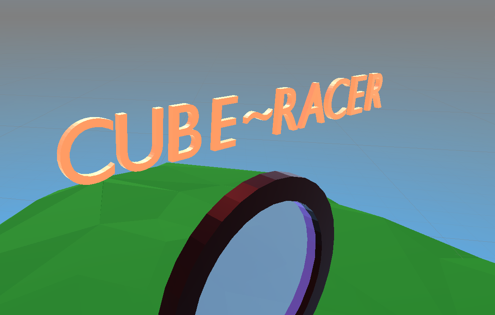
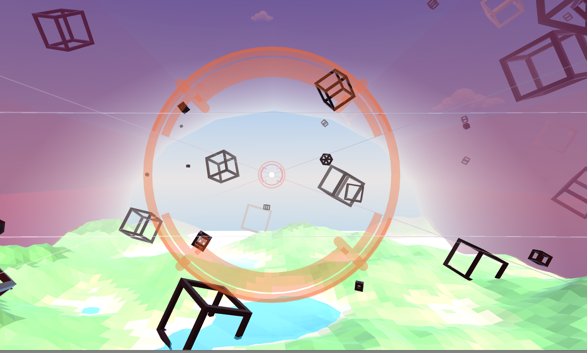

# cube_islands_portfolio

Portfolio Project for GoogleCardboard with a menu scene and different activities through portals on islands. Currently  consists of menu and one island, CubeRacer which is an endless runner style game for cardboard. Currently working on a tutorial/menu system and dynamic collision for cuberacer 

This project was loosely centered around the idea of exploring locomotion based experiences that show off the immersive value of virtual reality even on a system with incredibly limited user input, such as Google Cardboard. Currently, the entire project is usable and the games are playable, even on headsets _without_ the standard one button input functionality that comes with cardboard. 

## Menu Scene

The menu scene consists of several islands around a large cube. The goal is to plan a variety of experiences all accessible through portals on different islands around the cube. Currently, there is only the starting island, which will have a tutorial feature soon, and an island with a portal to Cube Racer (LINK HERE) (endless runner style flying game). 

### Menu Scene Locomotion

Gif/image
The locomotion system used in the menu is based around allowing users to "fly" around in 3D space  without button input. I wanted users to be able to both start/stop, and fully retain the ability to look in any direction without vision being obstructed by button UI. The menu scene achievese this through a start/stop button disabling system that detects when a users gaze towards a button has significantly altered in velocity, as it might if they were naturally looking around, and disabling the start/stop button. 
* There are currently two buttons that both possess both start and stop functionality. 
* The buttons are at the top and bottom of the screen
* There is a (editable size) deadzone in the middle of the screen around where the users gaze would be horizontal.
* The algorithm that detects changes in acceleration and disables buttons _only_ activates when users gaze is _outside_ of this deadzone. 
* A small indicator ring will appear and snap to the cardboard reticle pointer to indicate to user when they are moving.
* Can easily be transported for use in another project (for instance a showcase of 3D models or art)

#### Relevant Scripts
* `MoveControlManager.cs` on PlayerControls empty under PlayerParent empty -- script that handles disabling of controllers
* `PlayerControlsPosition.cs on PlayerControls -- keeps controls in front of user
* `ControlFade.cs` on PlayerControls empty -- fades controllers based on position in vision
* `PlayerMove.cs` on PlayerParent -- Moves the entire stack
* `IndicatorManager.cs` on MoveIndicator object under MainCamera -- controls move indicator snapping

### Game Text 1.0

Uses 3D alphabet object prefabs to construct string messages passed to it through a function on a (static) singlet of the class `GameTextController`.
* `CreateNode` returns an empty that is the **parent** of the character prefabs of the message passed to it
* TextNodes must be created in reference to an object in the scene that you would like the text to be near or attached to
* `GameTextStyle` class on singlet has a constructor that can be used to create preset gameTextstyles from anywhere in the code that can be used to easily create multiple nodes with similar attributes.
* attributes of GameText that can only be set via its GameTextStyle include isParented (whether its parented to the object created in reference to), isButton (creates a button background on the text for a visually different style and animates the button on pointer hover and pointer click), lookAtPlayer (self explanatory -- under development), and isHUD (under development -- will rotate the HUD text if the orientation of the player is such that they cannot see it). 
* Nodes' message, textsize, material, and even the GameTextStyle used can be altered at runtime even after creating the node for the easy creation of tutorials and other interactive elements. This allows you to re-use the same node for a variety of purposes rather than having to generate a completely new one. 
* adaptable rotation and location offsets to parent when creating nodes. 
* can easily be adapted to another project, all that is need is any alphabet asset package, `GameText.cs`, `TextNode.cs`, `GameTextCharacter.cs`, and `ButtonPad.cs`/the buttonpad prefab -- TextNode prefab can be any empty with `TextNode.cs` on it and is just the "anchor" for the characters instantiated.

#### Future Plans for Game Text
* light weight/portable menu system where "text nodes" (empties with textcharacter prefabs as children) can function as buttons, text, and be set to do a variety of UI style interactions 
* Create types of `GameText` you can create with preset materials and sizes from the arrays in `GameTextController` to simply function calls
* Full menus could be created just with button/nonbutton types of textnodes and position offsets from a singlescript very easily

### Future Plans for Menu Scene
* Tutorial for locomotion system using new GameText feature
* Removing the top  start/stop buttons from the menu locomotion scheme (after testing and feedback it doesn't seem like its necessary to have both). 
* Disabling algorithm for locomotion buttons will become sensitive to the user's vision turning, disabling the button if the user's gaze is not maintaining an approximately an vertical course towards the button, making the disable more natural and responsive.
* Potentially a cool interactive 3D perlin cube structure spawning within the center cube
* Menu's allowing the user to change colors in the environment

## Cube Racer

Cube Racer is an in development endless runner style game in 3D space over terrain. The locomotion system in this cardboard experience was created around an idea for making flying jet-plane like experience in a surreal environment.

### Cube Racer Locomotion

* User steers on a joystick-like pad like. The joystick allows them to turn their entire "rocket suit" using quaternions based on an indicator that moves on the joystick "pad" based on where they are looking. 
* users can look around at their environment by quickly looking off the pad which will cause the indicator to snap back to its center position on the joystick pad.

#### Relevant Scripts

* `RocketJoystick.cs` on the RocketHUD empty under PlayerParent empty.
* `BoundaryManager.cs` `TileManager.cs` and `TerrainChunkManager.cs` on spawner empty under playerparent. Control boundary tube pool, terrain/obstacle tile pools. 
* `CubeFactory.cs` -- on terrain prefabs. Controls obstacle spawning and types. 

#### Future Plans for Cube Racer
* Make delay indicator move when user reticle re-enters joystick pad -- making looking around feel more natural and encourage players not to oversteer making them adapt to locomotion system quicker. 
* Create menu system and tutorial using GameText
* Create dynamic terrain collider and obstacle collision
* Create large lake tiles that will enable the game position to be rest to origin worldspace
* Create fuel system a fuel capsules as well as stars for points
* Stars and fuel will spawn **inside** cube obstacles requiring the player to navigate through treacherous terrain
* Create a difficulty system
* Feels very clunky to use in unity (its hard to move your mouse at a constant rate) but feels better once built to iphone.
* Create more obstacle and spawning-location-organization types (current system allows for easy implementation of new obstacle types and spawn patterns such as 3d perlin noise patterns for "clouds" of smaller cubes)

### Procedural Terrain

Terrain used in Cube Racer scene uses a procedural low-poly terrain generator I created that uses a modified algorithm of octaves of perlin noise. A standalone way to access the terrain generator is in the `procedural test` scene in the scenes folder.

* System is comprised of a `NoiseGenerator.cs` script on an empty "map generator" and a `GenDiscreteNormalMesh.cs` Script on a nested empty "Terrain".
* The general terrain settings are set in the `NoiseGenerator.cs` inspector window. 
* The specifics of the tile and cellsize (which are also fully customizeable) are on inspector for the `GenDiscreteNormalMesh.cs` script. 
* If you place a `GenDiscreteNormalMesh.cs` script (and assign the proper references) on and empy and place it anywhere level with other terrain tiles connected to the same `NoiseGenerator.cs`, their terrain will line up properly with the other terrain tile based on the location of the empty -- making tile creation very very easy. 

#### Noise Generator
* It is highly customizable using the height, lacunarity (frequency of higher octaves of perlin noise), and persistance (amplitude of higher octaves). 
* Keep in mind persistance should be a value between 0 and 1, usually on the low end. 
* Lacunarity should be a value between 0 and 10 approximately.  
* Creates low-poly style terrain by repitition of vertices rather than via shaders allowing for use in later generation of dynamic collider meshes that are accurate to terrain. 
* Inspector allows (relatively) easy management/customization of different terrain height colors

The customization of the NoiseGenerator inspector allows for a very wide variety of low-poly style terrain generation, even with just one color scheme. Examples below:

